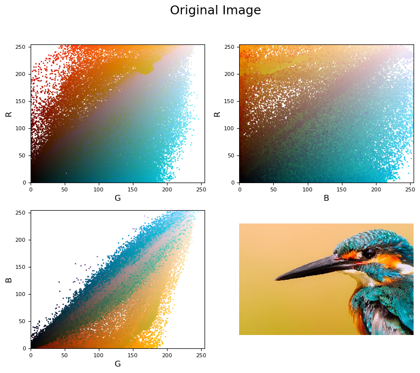
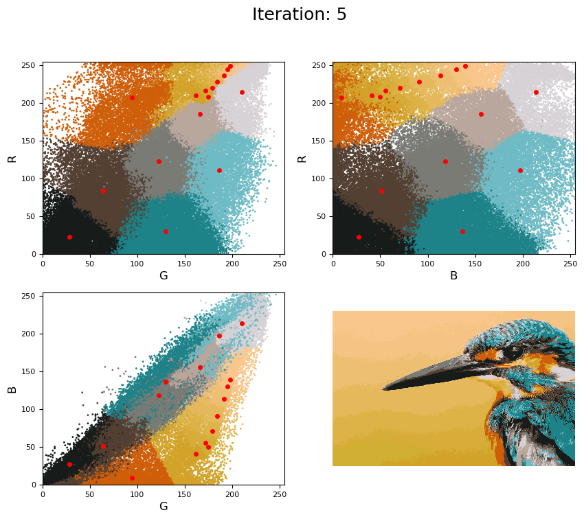

# k-means-image-compression

### Example output

## Project Summary

This project produces a visualisation of the [k-means clustering algorithm](https://en.wikipedia.org/wiki/K-means_clustering) applied to image compression. The aim of the algorithm applied in this setting is to find a suitable palet of K colours that can be used simplify the image by approximating each pixel in the image to one of these K colours.

Each pixel, represented as an RGB tuple, can be thought of as a point in 3-dimensional RGB space. The first slide of the visualisation shows three projections of this space with each pixel of the original input image plotted and coloured according to its RGB value. The input image is shown bottom right.

### Initial visualisation

The colouring of each pixel in the output image is determined by the RBG value of the pixels nearest centroid. The centroids are initialised as a random sample of size K from the original images pixels. On each iteration the positioning of the centroids is updated via the k-means algorithm.

Each iteration is plotted in a similar manner to the first slide, but each pixel is coloured according to it's nearest centroid and the centroids themselves are plotted in red. The bottom right subplot shows the current clustering applied to the image. The program then outputs a gif showing each iternation in succession. An example iteration is shown below.

### Example iteration

The program also outputs the final compressed image in jpg format. Below shows the original image and the output image for comparison.

### Input image

### Compressed image

